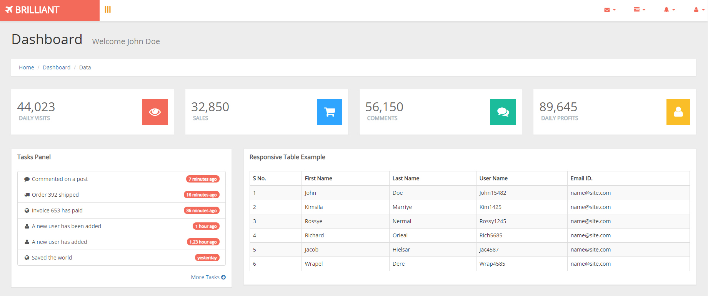
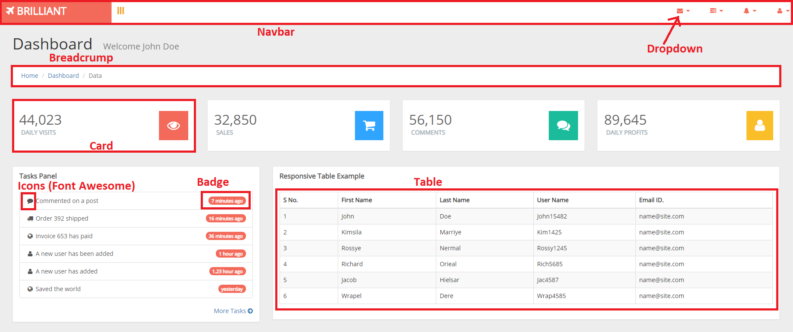
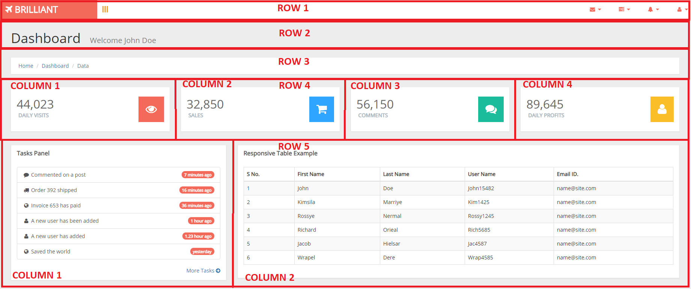

## Background & Objectives

Thanks to bootstrap, we can create a full page in minutes using already made components like Cards, Breadcrumps, Buttons, etc... You only need to know the HTML structure and the names of the classes (which you can find on the <a href="https://getbootstrap.com/docs/4.3/components/alerts/">official documentation</a>)

## Specs

Your client (a promising start-up) is making a web application to control their product stock. They have hired you to create an administration page for them. Take a look at the design they have delivered:

As you are a proffesional web developer, you have identified several built-in components from bootstrap that you can use, for example:

Knowing this, you decide to use bootstrap. The first step you need to take is the design of the grid:

At this step you don't really care about the components. You just start by doing the grid empty (the rows and the columns).

Once you have the grid done, you just have to search on bootstrap's documentation the components you need, and add the HTML tags with their respective classes inside the columns.

Do this in a file called `index.html`. Also, if you need to add some custom CSS properties, you can create an `index.css` file on this folder.

## Tips

As mentioned, you have to start by simply doing and empty grid with the rows and the columns. Once the grid is done, you can start adding the components one by one.

Some components are nested one inside another. For example, take a look at the Cards: each card has other components on the inside, like tables or the breadcrump.
