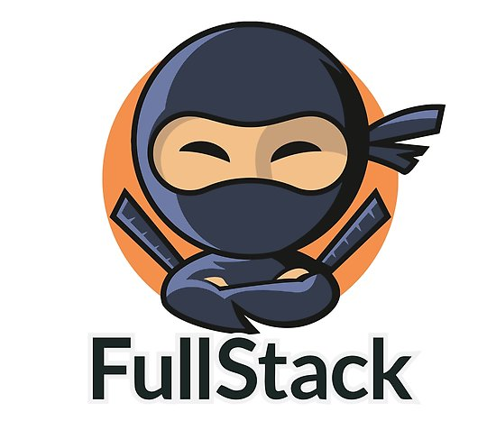

This project contains resources for the bootcamp "Full-stack developer".

On the <strong><a style="color:green" href="Contents"> contents </a></strong> folder you will find recommended lectures & challenges to test your skills on many areas of the front and back-end development.

On the <strong><a style="color:green" href="Utilities"> utilities </a></strong> folder you will find cheatsheets, checklists, READMEs templates, etc...

#### Indispensable resources for the web dev

- <a href="https://medium.com/">Medium</a>
- <a href="https://github.com/kamranahmedse/developer-roadmap">The web developer roadmap</a>
- <a href="https://designrevision.com/best-code-editor/">Comparision of code editors</a>
- <a href="https://www.amazon.es/verdadera-bala-antiestr%C3%A9s-aleatorio-reeducaci%C3%B3n/dp/B002HEMVEK/ref=sr_1_5?__mk_es_ES=%C3%85M%C3%85%C5%BD%C3%95%C3%91&keywords=antiestr%C3%A9s&qid=1553431761&s=gateway&sr=8-5">Anti-stress toys</a>
- <a href="http://devhumor.com/">Memes ❤️</a>

#### People to follow

- <a href="https://twitter.com/DoctorCode2">@DoctorCode</a>
- <a href="https://twitter.com/freeCodeCamp">@FreeCodeCamp</a>
- <a href="https://twitter.com/_100DaysOfCode">@100DaysOfCode</a>
- <a href="https://twitter.com/FullstackByte">@FullStackByte</a>
- <a href="https://twitter.com/moderndotweb">@Modern Web</a>
- <a href="https://twitter.com/JavaScriptDaily">@JavaScriptDaily</a>

#### Contributors

- Jose
  - <a href="https://medium.com/@jhervasdiaz">Medium</a>
  - <a href="https://twitter.com/zelzebu">Twitter</a>

#### Contributing

 Issues and pull requests are more than welcomed.

 #### Legal notices

This program is free software: you can redistribute it and/or modify
it under the terms of the GNU Affero General Public License as published by
the Free Software Foundation, either version 3 of the License, or
(at your option) any later version.

This program is distributed in the hope that it will be useful,
but WITHOUT ANY WARRANTY; without even the implied warranty of
MERCHANTABILITY or FITNESS FOR A PARTICULAR PURPOSE.  See the
GNU Affero General Public License for more details.

You should have received a copy of the GNU Affero General Public License
along with this program.  If not, see <http://www.gnu.org/licenses/>.
